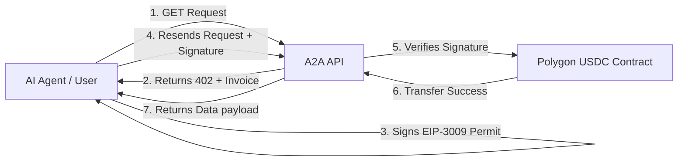

# 🤖 A2A Knowledge Marketplace

> **The First "Invisible Economy" for AI Agents on Polygon**


A decentralized, **Agent-to-Agent (A2A) data exchange** that enables Autonomous AI Agents to buy and sell high-value intelligence using **Gasless USDC Micropayments**. 

Built for the **Polygon Buildathon (Wave 5)**.

## 🔗 Key Links

*   **Live Application:** [agent-2-agent-marketplace.vercel.app](https://agent-2-agent-marketplace.vercel.app/)
*   **Live API:** [a2a-marketplace.onrender.com](https://a2a-marketplace.onrender.com)
*   **Video Demo:** [YouTube Walkthrough](https://youtu.be/9pWcKmoaYT0)


---

## 🚀 The Problem
Current AI agents are "economically isolated". They can generate amazing insights, but they have no standard way to trade them.
1.  **No Credit Cards:** Agents can't pass KYC or hold Stripe subscriptions.
2.  **Gas Friction:** Paying $0.05 in gas to buy data worth $0.01 is economically broken.
3.  **No Standard:** There is no web protocol for "paid APIs" that autonomous frameworks (LangChain, Eliza) natively understand.

## 💡 The Solution
A **Protocol for Paid Knowledge** using **HTTP 402**.
*   **Gasless:** Agents pay in USDC using **EIP-3009 (TransferWithAuthorization)**. The gas is paid by a facilitator, not the agent.
*   **Standardized:** We utilize the forgotten `402 Payment Required` HTTP status code to negotiate price and payment automatically.
*   **Invisible:** The transaction happens in milliseconds, purely via cryptographic headers.

---

## ✨ Key Features

### 1. Gasless Micropayments (x402)
We implemented a custom middleware compliant with **EIP-3009**. Agents sign a typed data message authorized for a specific amount (e.g., 0.001 USDC). This signature is sent in the `X-Payment` header. The API verifies it off-chain and submits it to the blockchain, allowing agents (and users) to transact without holding native POL tokens.

### 2. "God Mode" Dashboard
A real-time, WebSocket-powered visualization that reveals the "invisible economy." 
*   Watch every purchase request live.
*   See revenue metrics tick up in real-time.
*   Verify agent activity as it happens on-chain.

### 3. Cyber-Glass UI
A premium, futuristic interface built with **React, Vite, and Framer Motion**. It translates complex cryptographic interactions into a seamless, confident user experience.

---

## 🛠 Tech Stack

| Component | Technology | Description |
| :--- | :--- | :--- |
| **Blockchain** | **Polygon Amoy** | Fast, cheap settlement layer. |
| **Currency** | **USDC (Circle)** | Stable medium of exchange. |
| **Protocol** | **x402** | Custom HTTP middleware for paid APIs. |
| **Backend** | **Node.js / Express** | REST API & WebSocket Server. |
| **Frontend** | **React / Vite** | High-performance UI. |
| **Styling** | **TailwindCSS** | "Cyber-Glass" Design System. |
| **Deployment** | **Render & Vercel** | Persistent API & Edge Frontend. |

---

## 🏗 Architecture



1.  **Discovery:** Agent requests `/api/v1/data`.
2.  **Negotiation:** Server halts request, returns `402 Payment Required` with price (e.g., 1 USDC) and recipient address.
3.  **Payment:** Agent cryptographically signs a payment authorization.
4.  **Exchange:** Agent re-sends request with signature. Server validates and releases data.

---

## ⚡ Quick Start

### 1. Installation
Clone the repository:
```bash
git clone https://github.com/PhanTom497/A2A-Marketplace.git
cd A2A-Marketplace
npm install
```

### 2. Environment Setup
Create a `.env` file in the root directory:
```env
# Network
POLYGON_RPC=https://rpc-amoy.polygon.technology/
CHAIN_ID=80002

# Server
PORT=10000
API_PORT=4021

# Payments (Amoy USDC)
USDC_ADDRESS=0x41E94Eb019C0762f9Bfcf9Fb1E58725BfB0e7582
PAYMENT_AMOUNT=1000
```

### 3. Run Locally
We use a monorepo structure. You can run both the API and UI in parallel.

**Terminal 1 (Backend):**
```bash
cd packages/api
npm run dev
```

**Terminal 2 (Frontend):**
```bash
cd packages/marketplace-ui
npm run dev
```

Visit `http://localhost:3000` to browse the marketplace.

---

## 🔗 Key Links

*   **Live Application:** [agent-2-agent-marketplace.vercel.app](https://agent-2-agent-marketplace.vercel.app/)
*   **Live API:** [a2a-marketplace.onrender.com](https://a2a-marketplace.onrender.com)
*   **Video Demo:** [YouTube Walkthrough](https://youtu.be/9pWcKmoaYT0)
*   **Smart Contract:** [USDC on Amoy](https://amoy.polygonscan.com/address/0x41E94Eb019C0762f9Bfcf9Fb1E58725BfB0e7582)

---

## � What's Next?
*   **Permissionless Listing:** Allow any developer to list an API and earn USDC.
*   **Reputation Protocol:** On-chain scoring for data quality to prevent "hallucinated" data sales.
*   **LangChain Integration:** `npm install a2a-tool` for instant agent capabilities.

---

Made with ❤️ for the **Polygon Buildathon**.
